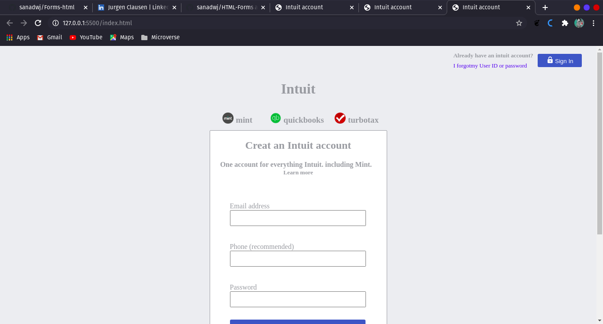

# Project Name: Mint Sign Up page clone

> In this project we worked with forms and inputs in HTML and was styled with CSS3, to create a sign up page clone of Intuit Mint.

## Built With

- HTML, CSS3
- No frameworks used
- VS code with live server

## Live Demo

[Live Demo Link](https://livedemo.com)

## Getting Started

To get a local copy up and running follow these simple example steps.

### Prerequisites
    Code Editor

### Setup
    Clone repo to local machine with cmd: git clone '

### Install
    Live Server

## Authors

👤 **Sanad**

- Github: [@sanadwj](https://github.com/sanadwj)
- Linkedin: [Sanad Abujubara](https://www.linkedin.com/in/sanad-abu-jubara-51516548/ )

👤 **Jurgen**

- Github: [@jurgen1c](https://github.com/jurgen1c)
- Linkedin: [Jurgen Clausen](https://www.linkedin.com/in/jurgen-clausen-2740061a9/)

## 🤝 Contributing

Contributions, issues and feature requests are welcome!

Feel free to check the [issues page](issues/).

## Show your support

Give a ⭐️ if you like this project!

## Acknowledgments

- Hat tip to anyone whose code was used
- Inspiration
- etc

## 📝 License

This project is [MIT](lic.url) licensed.
